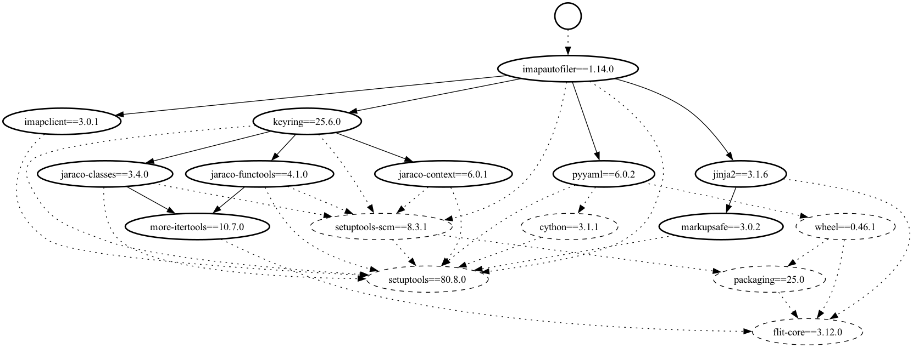

Creating Visual Dependency Graphs
=================================

The ``fromager graph to-dot`` command converts your dependency graph into a DOT format file that can be used with Graphviz to create visual representations of your package dependencies.

Prerequisites
-------------

To create images from DOT files, you'll need Graphviz installed:

.. code-block:: bash

   # On macOS with Homebrew
   brew install graphviz

   # On Ubuntu/Debian
   sudo apt-get install graphviz

   # On RHEL/CentOS/Fedora
   sudo dnf install graphviz

Basic Usage
-----------

Convert a graph file to DOT format:

.. code-block:: bash

   fromager graph to-dot e2e/build-parallel/graph.json

This outputs the DOT format to stdout. To save it to a file:

.. code-block:: bash

   fromager graph to-dot e2e/build-parallel/graph.json --output dependency-graph.dot

Creating Visual Images
----------------------

Once you have a DOT file, create a PNG image:

.. code-block:: bash

   fromager graph to-dot e2e/build-parallel/graph.json --output graph.dot
   dot -Tpng graph.dot -o dependency-graph.png

.. literalinclude:: example-graph.dot
   :language: text

Complete Example
----------------

Here's a complete workflow to create a visual dependency graph:

.. code-block:: bash

   # Create DOT file from graph
   fromager graph to-dot e2e/build-parallel/graph.json --output full-graph.dot

   # Create PNG image
   dot -Tpng full-graph.dot -o full-dependency-graph.png

   # Create a simplified version with only install dependencies
   fromager graph to-dot e2e/build-parallel/graph.json --install-only --output install-graph.dot
   dot -Tpng install-graph.dot -o install-dependencies.png

Options
-------

Install Dependencies Only
~~~~~~~~~~~~~~~~~~~~~~~~~

Use ``--install-only`` to show only runtime installation dependencies, excluding build-time dependencies:

.. code-block:: bash

   fromager graph to-dot e2e/build-parallel/graph.json --install-only --output runtime-deps.dot

This creates a cleaner graph focused on what gets installed rather than what's needed for building.

Understanding the Visual Output
-------------------------------

The generated graph uses different visual elements to represent different types of packages:

**Node Shapes:**

- **Circle**: Top-level requirements
- **Oval**: Regular dependencies
- **Box**: Packages with build settings/overrides
- **Parallelogram**: Pre-built packages
- **Note shape**: Packages with patches
- **Trapezium**: Packages with plugins
- **Triple octagon**: Packages with both plugins and patches

**Edge Styles:**

- **Solid lines**: Installation dependencies
- **Dotted lines**: Build-system dependencies
- **Bold edges**: Installation constraints (when not using --install-only)
- **Dashed edges**: Build-only dependencies (when not using --install-only)

**Colors:**

- All nodes have black borders with white fill by default
- Bold edges indicate packages that will be installed in the final environment
